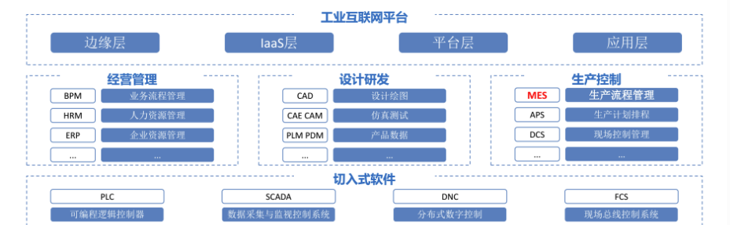

# 实训过程总结



- 产品管理页面，有产品名称、规格等信息，包含校验；

- 物料管理页面，有物料名称、物料编码（编码唯一）等信息,包含属性校验，重写CURD方法，新增编码规则，按照编码规则生成物料编码。

- 工艺路线管理页面，工艺路线名称，工艺路线编码，关联产品，包含属性校验。
- 产品 BOM 标签页。显示产品关联的物料。产品 BOM 有数量属性。
- 产品 BOM 的添加、删除功能。
- 供应商管理页面，有供应商名称，供应商地址，供应商联系电话，供应商Email等以及实现供应商资质PDF文档上传下载；（结合MIIO文件服务器）


## 难点一 编码规则

### BarcodeDetail类实现

见代码

### BarcodeRule类实现

见代码

### 模型添加自动编码
对于各个需要自动编码的模型添加下面的函数。
重写create方法

```java
    public RecordSet create(List<Material> valueList){
        valueList.forEach(m->{
            String materialCode = new BarcodeRule().getBarcode(m.getCode());
            m.setCode(materialCode);
        });
        return (RecordSet) getMeta().get("material") //注意这里可以根据模型进行修改
                .callSuper(Material.class,"create",valueList);
    }
```

  

‍

  
## 难点二 文件上传下载

### 前端修改


#### MinIO的本地API地址

target: 'http://127.0.0.1:19000/fileSystem/'

```js
// webpack 工程开发环境 配置
const { merge } = require('webpack-merge');
const common = require('./webpack.common');
const devMerge = require('@tech/t-build/BuildWebpack/webpack.dev.merge.js');
const mergeCommon = merge(common, devMerge);

module.exports = merge(mergeCommon, {
  devServer: {
    port: '30666', // 本地启动端口
    proxy: {
      '/fileSystem': {
        target: 'http://127.0.0.1:19000/fileSystem/', // 本地开发时改为类似 http://192.168.168.9:8085/, 不需要fileSystem
        pathRewrite: { '^/fileSystem': '' }
      },
      '/api': { 
        target: 'http://127.0.0.1:8060', 
        pathRewrite: { '^/api': '' }
      },
      '/register': {
        target: 'http://192.168.168.176:8080/', // 本地开发时改为类似 http://192.168.168.9:8085/, 不需要api
        pathRewrite: { '^/register': '' }
      }
    }
  }
});

```

### 后端修改

#### 模型

新增属性

```Java
@Property(displayName = "供应商资质文件",dataType = DataType._FILE_,contentType = "pdf",toolTips = "上传供应商资质文件")
private String certificationDocs;
```

#### 视图

可以自动`生成视图`


## 难点三 指定显示类的其他字段

[模型属性 | IIDP (chinasie.com)](http://iidp.chinasie.com:9999/iidpdoc/pages/41d2c6/#manytoone)

### @**ManyToOne**

采用`@ManyToOne`对`er`关系多对一进行描述,也可以参考


#### 1. 通过注解displayFormat指定任意的显示字段

支持单个和多个字段格式化输出,格式为:${propery1}-${propery2},(指定的字段不能是related字段)

```Java
@ManyToOne(displayName = "组织", targetModel = "res_enterprise", cascade = {CascadeType.DEL_SET_NULL},displayFormat ="${code})
@ManyToOne(displayName = "组织", targetModel = "res_enterprise", cascade = {CascadeType.DEL_SET_NULL},displayFormat ="${name}-${code})
@JoinColumn(name = "org_id", referencedProperty = "id")
private Map<String, Object> enterprise;
```

#### 2. 关联非ID字段：通过注解referencedProperty可以指定其他字段(默认是ID字段)

通过注解referencedProperty可以指定非id字段,存储到数据库中值为code字段的值

```java
@ManyToOne(displayName = "组织", targetModel = "res_enterprise", cascade = {CascadeType.DEL_SET_NULL})
@JoinColumn(name = "org_code", referencedProperty = "code")
private Map<String, Object> enterprise;
```


#### 3. 同一个App内

```Java
@ManyToOne(displayName = "班级", cascade = CascadeType.DEL_SET_NULL)
@JoinColumn(name = "class_id", referencedProperty = "id")
private ExampleClass exampleClass;
```

[模型ER关系 | IIDP (chinasie.com)](http://iidp.chinasie.com:9999/iidpdoc/pages/4e9088/#er%E5%85%B3%E7%B3%BB%E7%A4%BA%E4%BE%8B)


@**JoinColumn**

|字段名|中文名|类型|默认值|是否必填|
|---|---|---|---|---|
|name|数据库表列名,当前表会添加一列org_id|String||是|
|referencedProperty|默认会和one方的主键id关联,  <br>如果是非id字段,需要指定属性名,比如code|String|id|否|
|length|列长度|int|64|否|

### 简述

```java
@JoinColumn(name = "class_id", referencedProperty = "id")
```

`name`是要下拉栏填入的数据库列名，是当前/写在的类 数据库中的一列

`referencedProperty`是下方类的属性，选择要显示的类的属性


## 参考资料

链接：[IIDP 谷神工业数字平台](http://iidp.chinasie.com:9999/iidpdoc/)